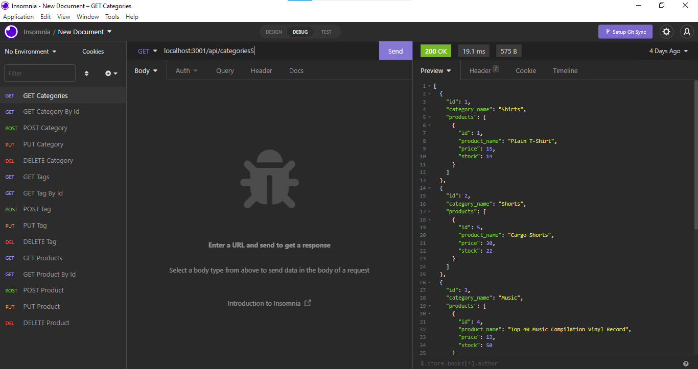
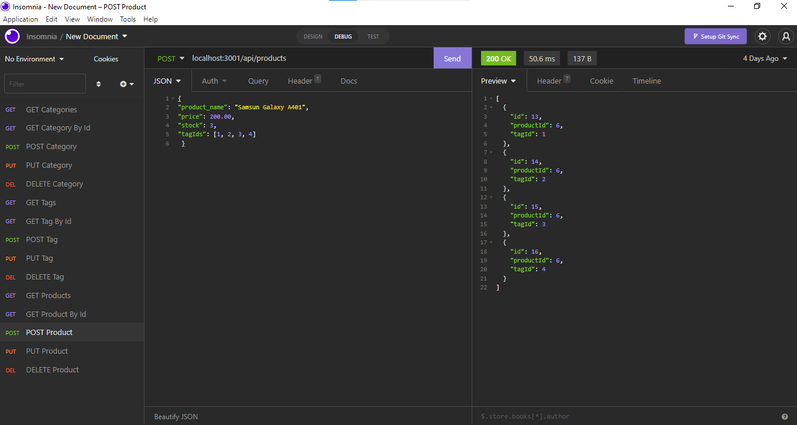

# EcommerceStore

The manager at an internet retail company wants a backend that uses the latest technology, in order to compete with other e-commerce sites.

In the presence of an Express.js API
In an environment variable file, I define the name of my database, the MySQL username, and the MySQL password
Using Sequelize, I am able to connect to a database
As soon as I enter schema and seed commands
Then a development database is created and seeded with test data
The application is invoked when I enter the command
My server is then started and the Sequelize models are synchronized with MySQL
A GET route for categories, products, or tags opens in Insomnia
A formatted JSON file is then displayed for each of these routes
Insomnia tests API POST, PUT, and DELETE routes
After that, I am able to create, update, and delete data in my database successfully

## Github Link
https://github.com/AbdulQadir51/EcommerceStore

## Video Link
https://www.loom.com/share/fe24cb236a56486c968287b996f6756f

## Screenshots
 
 
